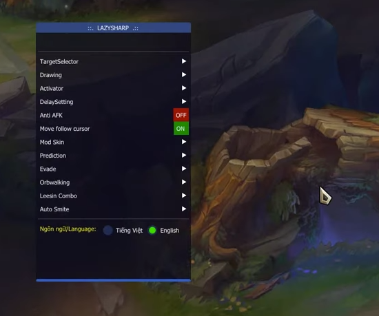

# SCREEN PVLOL [10.4 UPDATE]

Core Control : http://dl.seotop.org/PVLOL_QTE/Core1.json

Riot Server DLL : http://dl.seotop.org/PVLOL_QTE/PVLOL104.DAT

Garena Server DLL : http://dl.seotop.org/PVLOL_QTE/PVLOL103.DAT

# PVLOL Hook Inject [10.4]
How it works: Hook inject. [When the hook takes the point, if the dll sees that point, it will be injected and run] If the pointer does not get the desired value, the dll will not be inject.

# How to find a hook pointer?
85 F6 74 0F 8D ?? ?? ?? ?? sigma engine with find
This is an offset value. Copy pointer.
Paste it into the writepointerinteger array in the Pvlol_succes section.
Put the dll you want to be next to the exe program.

# We broke the Eazfuscator protection and read inside.
The method of injecting the software in the MemoryHackers platform with the hook method is shown.
LazySharp - General dependencies
This is free distributed software. We do not accept legal responsibility. It is shared only for learning and software development purposes.

My Contact: sanghoontargaryen@yandex.com

==============================================================

# PVLOL 후크 인 젝트 [10.4]

작동 방식 : 후크 인 젝트. [후크가 점을 찍을 때 dll이 해당 점을 발견하면 주입되고 실행됩니다] 포인터가 원하는 값을 얻지 못하면 dll이 주입되지 않습니다.

# 후크 포인터를 찾는 방법?
85 F6 74 0F 8D ?? ?? ?? ?? 찾기 시그마 엔진
이것은 오프셋 값입니다. 포인터를 복사하십시오.
Pvlol_succes 섹션의 writepointerinteger 배열에 붙여 넣습니다.
exe 프로그램 옆에 원하는 dll을 넣으십시오.

# 우리는 Eazfuscator 보호를 중단하고 내부를 읽습니다.
후크 방식으로 MemoryHackers 플랫폼에 소프트웨어를 주입하는 방법이 표시됩니다.
LazySharp-일반 종속성
이것은 무료로 배포되는 소프트웨어입니다. 우리는 법적 책임을지지 않습니다. 학습 및 소프트웨어 개발 목적으로 만 공유됩니다.

내 연락처 : sanghoontargaryen@yandex.com